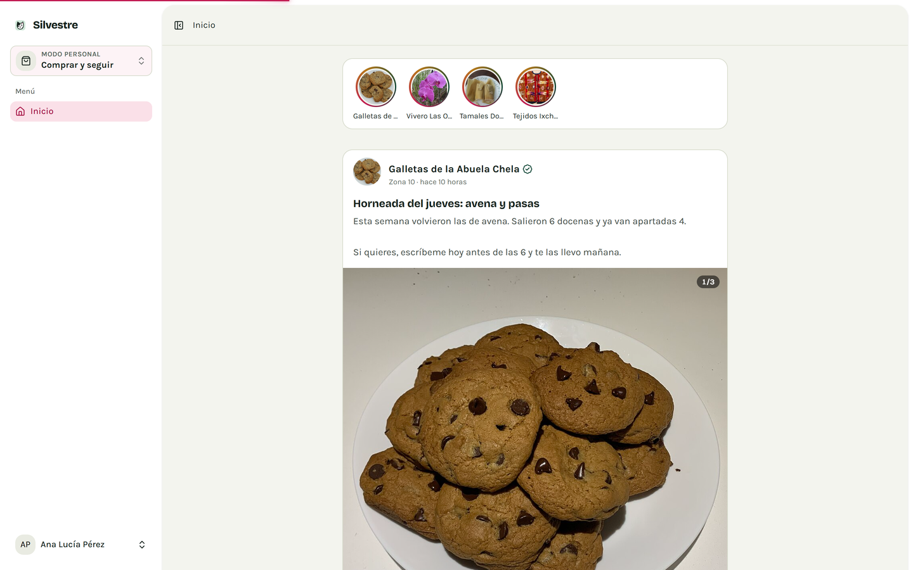
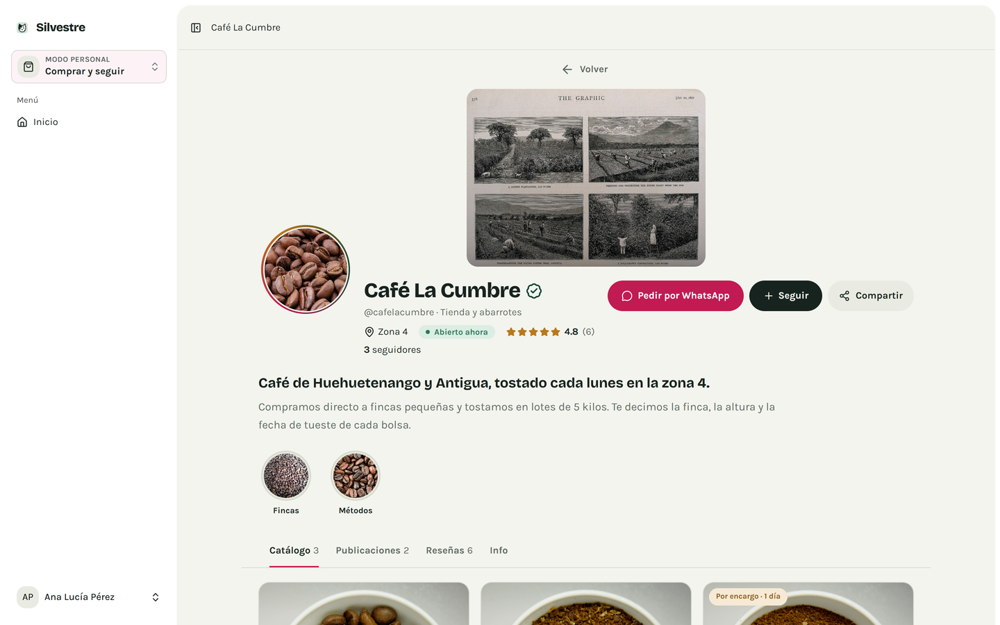
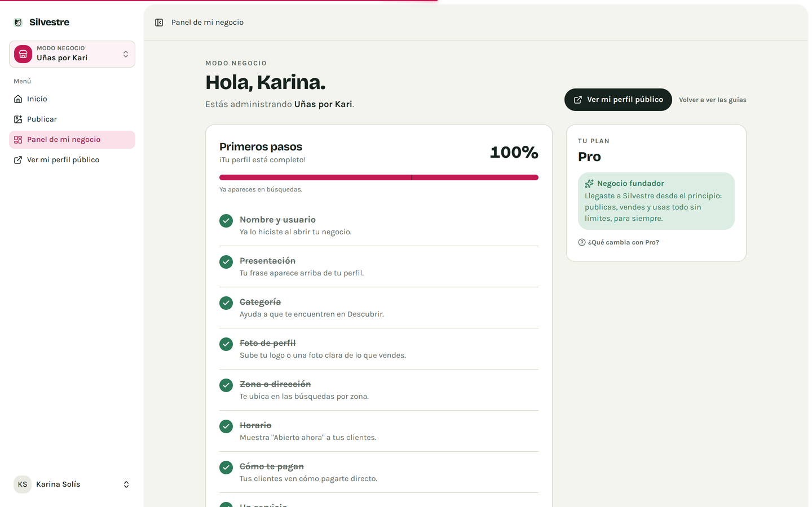
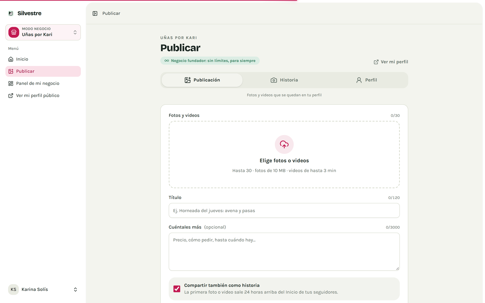
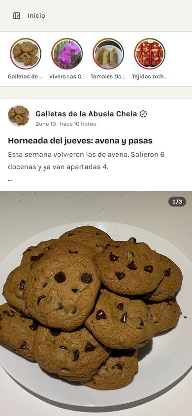
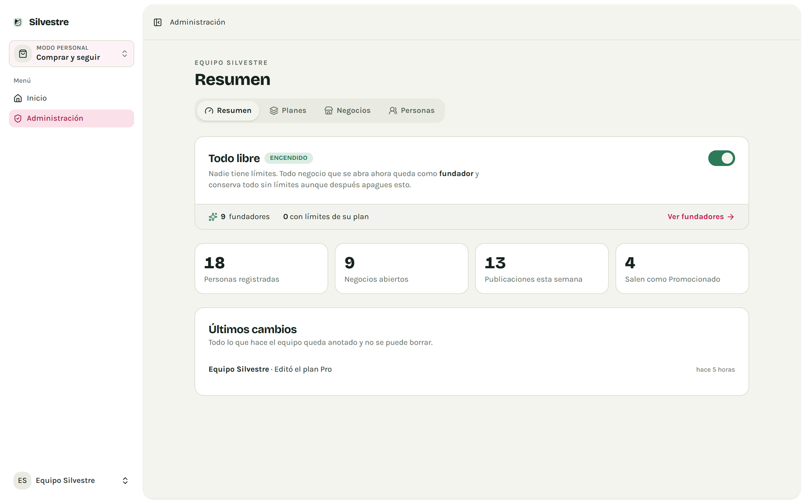
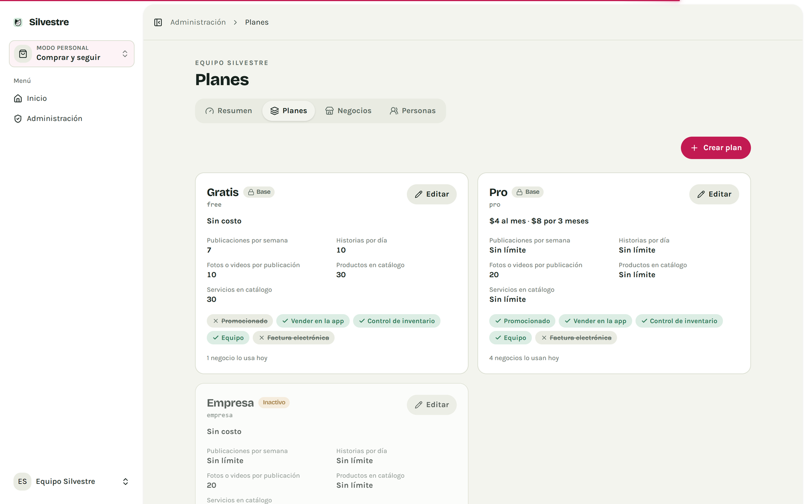

<div align="center">

# 🐱 Silvestre

**La red social de los negocios pequeños de Guatemala.**

Un lugar donde una señora que vende tamales, una barbería de barrio o un vivero
tienen el mismo perfil, las mismas historias y las mismas herramientas que una
tienda grande. Todo gratis.

[](https://github.com/jorge0123/silvestre/actions/workflows/tests.yml)

</div>

---

## Qué es

Silvestre funciona como una red social, pero pensada para vender. Cada negocio
tiene su perfil con foto, portada, presentación y su propio enlace para mandar
por WhatsApp (`@tunegocio`). Publica fotos y videos, sube historias de 24 horas,
recibe reseñas con estrellas y gana seguidores.

Quien compra abre su **Inicio** y ve, en una sola lista: lo nuevo de los
negocios que sigue, negocios sugeridos y publicidad de quienes pagan plan.

|                               |                                                                                                                   |
| ----------------------------- | ----------------------------------------------------------------------------------------------------------------- |
| **Dónde arranca**             | Ciudad de Guatemala                                                                                               |
| **Cómo se cobra entre ellos** | El cliente le paga **directo** al negocio (efectivo, transferencia, contra entrega). Silvestre no toca ese dinero |
| **De qué vive Silvestre**     | Solo de las suscripciones Pro: $4 al mes u $8 por 3 meses, por transferencia                                      |
| **Qué cuesta usarlo**         | Nada. Publicar, vender, historias y reseñas son gratis                                                            |

## Cómo se ve

|                                                 |                                                |
| ----------------------------------------------- | ---------------------------------------------- |
| **Inicio**, al estilo de una red social         | **Perfil del negocio**                         |
|   |  |
| **Panel del negocio**: qué le falta para vender | **Publicar**: publicación, historia o perfil   |
|        |         |

<details>
<summary><b>En el celular</b> y <b>el panel de administración</b></summary>

| En el celular                                | Administración                                      | Planes                              |
| -------------------------------------------- | --------------------------------------------------- | ----------------------------------- |
|  |  |  |

</details>

## Pruébalo

### Sin instalar nada, desde el navegador

[](https://codespaces.new/jorge0123/silvestre?quickstart=1)

Ese botón levanta Silvestre en una máquina de GitHub con todos los datos de
prueba. Tarda unos minutos la primera vez; cuando termine, GitHub abre el
puerto **8000** y ya puedes entrar con las cuentas de más abajo. Necesitas una
cuenta de GitHub (el plan gratuito incluye horas de sobra para verlo).

### En tu computadora

Se levanta en unos minutos y trae **datos de prueba**: 9 negocios con fotos,
videos, historias, reseñas y comentarios de verdad.

**Necesitas:** PHP 8.3 o más, [Composer](https://getcomposer.org) y
[Node.js 22](https://nodejs.org) o más.

```bash
git clone https://github.com/jorge0123/silvestre.git
cd silvestre
composer setup              # instala todo, crea el .env y la base de datos
php artisan migrate:fresh --seed   # datos de prueba con fotos y videos
php artisan dev             # abre http://localhost:8000
```

> Las fotos de prueba se descargan de Wikimedia Commons la primera vez, así que
> el último paso tarda un par de minutos.

### Entra con estas cuentas

La contraseña de todas es **`secret123`**.

| Correo          | Quién es                             | Qué vas a ver                                                 |
| --------------- | ------------------------------------ | ------------------------------------------------------------- |
| `ana@test.gt`   | Una clienta                          | El Inicio: publicaciones, historias, reacciones y comentarios |
| `kari@test.gt`  | Dueña de Uñas por Kari               | Modo negocio: panel, publicar, historias, plan Pro pagado     |
| `chela@test.gt` | Dueña de Galletas de la Abuela Chela | Un negocio en sus días de prueba                              |
| `rosa@test.gt`  | Dueña de Vivero Las Orquídeas        | Un negocio en plan Gratis, con video                          |
| `nuevo@test.gt` | Se registró y aún no abre su negocio | El paso a paso para crear un negocio                          |
| `admin@test.gt` | Equipo de Silvestre                  | El panel de administración en `/admin`                        |

**Cambia de modo** con el botón de arriba a la izquierda: la misma cuenta sirve
para comprar y para administrar tu negocio.

## Qué ya funciona

- **Perfiles de negocio** con foto, portada, presentación, horario, zona y WhatsApp.
- **Publicaciones** con varias fotos y videos, reacciones y comentarios con respuestas, sin salir de la página.
- **Historias** de 24 horas y destacadas que se quedan en el perfil.
- **Inicio** con scroll infinito, sugerencias y publicidad de quienes pagan plan.
- **Una cuenta, dos modos**: comprar o administrar tu negocio, con guías dentro de la app.
- **Paso a paso para abrir un negocio**: qué vendes, dónde entregas, cómo te pagan, las reglas.
- **Reseñas con estrellas** de quien sí compró, con promedio bayesiano para que dos reseñas no le ganen a ochenta.
- **Reglas de lo que no se vende** en Guatemala (medicinas, armas, animales silvestres, servicios que piden colegiado activo…).
- **Panel de administración**: planes, precios, permisos y el interruptor "Todo libre".
- **Modo día y modo noche**, y todo pensado primero para el celular.

### Lo que sigue

Pantallas de productos y servicios · citas para barberías, salones y talleres ·
pagar la suscripción desde la app · subir documentos para verificarse ·
carrito y pedidos con seguimiento.

## Una promesa: los que llegan primero no pagan de más

Silvestre arranca con **"Todo libre"**: nadie tiene límites. Todo negocio que
se abra mientras eso esté encendido queda como **fundador** y conserva todo sin
límites **para siempre**, aunque mañana se apague.

Y cada suscripción guarda las condiciones y el precio del día en que entró. Si
el plan Pro sube de precio, quien ya pagaba $4 sigue pagando $4. Los cambios son
solo para quien llegue después.

## Cómo está hecho

Laravel 13 · Inertia + Vue 3 + TypeScript · Tailwind 4 · SQLite (o MySQL) ·
Pest/PHPUnit. **98 pruebas** cubren el Inicio, las publicaciones, los modos de
cuenta, el paso a paso y el panel de administración.

```bash
php artisan test     # pruebas
npm run check        # formato y lint
npm run types:check  # tipos
```

## Créditos y aviso

Las fotos y videos de prueba vienen de **Wikimedia Commons** y de MDN Web Docs,
con sus licencias y autores en [`docs/CREDITOS-FOTOS.txt`](docs/CREDITOS-FOTOS.txt).
Son solo para ver la app funcionando; no se usan en producción.

Silvestre está en desarrollo. El código es público para mostrar el proyecto,
pero todos los derechos están reservados.
